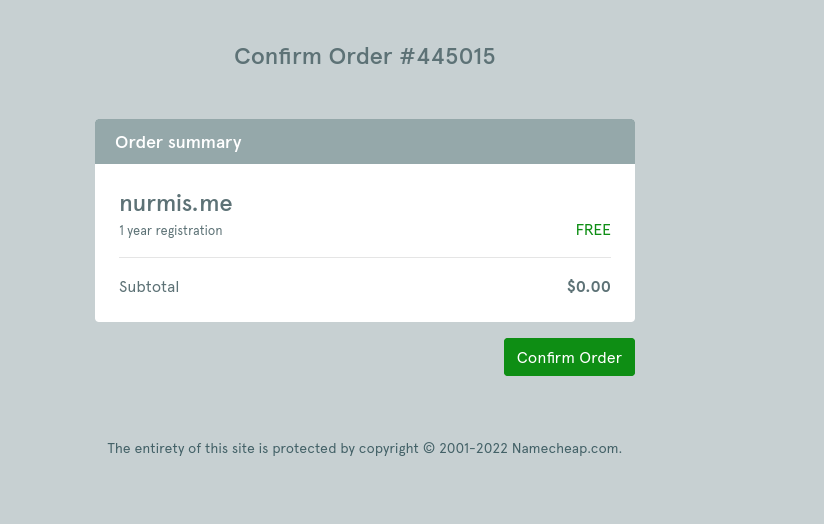

## h4 Julkisen palvelimen ja nimen vuokraaminen

Karvinen, T. 2022. Linux Palvelimet 2022. Luettavissa: https://terokarvinen.com/2021/linux-palvelimet-ict4tn021-3018/

#### Z) Tiivistelmät artikkeleista

#### a) Pilvi. Vuokraa ja asenna oma julkinen palvelin Internetiin. Vuokraa nimi osoittamaan siihen.

Vuokrasin julkisen pilven yritykseltä DigitalOcean. Kirjauduin sivustolle GitHubEducation-paketin tarjouspaketin kautta, jolloin sain 100 credittiä (euroa) käyttööni. Näin ei tarvitse käyttää omaa rahaa palvelun ylläpitoon. 

Valitsin ylävalikosta New Droplet. Valitsin halvimman mahdollisen prosessorin. En ottanut mitään ylimääräisiä paketteja tai palveluita. Kuten alla olevasta kuvasta käy ilmi, valitsin Debian 11 x64. Kaupungiksi valitsin Frankfurtin. Autentikointitavaksi salasanan.

Annoin palvelimelle nimeksi linuxs, ja painoin ok. Luominen kesti muutamia sekunteja. Alla kuva onnistuneesta luomisesta.

Seuraavaksi vuokrasin nimen palvelimelle. Tein vuokrauden palvelun NameCheap kautta. GitHubEducation-paketilla sain nimen vuokrauksen ilmaiseksi vuoden ajaksi.

Etsin ensiksi nimipalvelusta nimeä nurmi.me. Se oli jo käytössä. Kokeilin nurmis.me, ja tämä oli vapaana.

Vuokrasin tämän nimen onnistuneesti. 

Vuokrauksen jälkeen menin muokkaamaan asetuksia, jotta sain uuden nimeni osoittamaan oikeaan palvelimeen. Polku oli Dashboard –-> nurmis.me --> Manage –-> Advanced DNS. Vaihdoin oikean ip-osoitteen, kuten alla olevasta kuvasta näkyy. Ip-osoitteen sain selville DigitalOceanista palvelimeni tiedoista.

#### d) Suuri muuri. Suojaa palvelin tulimuurilla. Muista ensin reikä ssh-palvelimelle.

Otin yhteyttä asentamaani serveriin terminaalin kautta komennolla

    $ ssh käyttäjänimitähän@ip-osoitetähän

ja syötin serverin salasanan.

Seuraavaksi asensin ufw:n 

UFW eli Uncomplicated Firewall on työkalu Netfilter-palomuurin hallintaan.

    $ sudo apt-get update
    $ sudo apt-get install ufw
    
Asennus onnistui hyvin. Tämän jälkeen avasin ssh:lle portin palomuurista komennolla

    $ sudo ufw allow 22/tcp

Näin palvelimeen saadaan etäyhteys. Sitten aktivoin palomuurin käyttöön komennolla

    $ sudo ufw enable
    

    
Kun palomuuri on aktivoitu, se estää kaiken liikenteen tulon, ellei jollekin ole varta vasten avattu porttia. 

Tämän jälkeen tein uuden käyttäjän ja lisäsin sen sudo-ryhmään, jolloin se saa oikeuden ajaa sudo-komentoja: 

    $ sudo adduser käyttäjänimitähän
    $ sudo adduser käyttäjänimitähän sudo

Kirjauduin omalta koneelta palvelimelle komennolla

    $ ssh sonsku@nurmis.me
    
Tämä onnistui, joten poistin rootin käyttäjätunnukset käytöstä komennolla

    $ sudo usermod –lock root

    
Sain seuraavanlaisen ilmoituksen. En ole täysin varma, onnistuiko käytöstä pois otto...?

#### e) Served. Laita koneellesi Apache-weppipalvelin. Korvaa testisivu. Laita käyttäjän kotisivut toimimaan. Kokeile eri koneelta, esim. kännykällä, että sivut toimivat. Vinkki: tee kotisivut normaalina käyttäjänä public_html/ alle.

Asensin apachen komennolla

    $ sudo apt-get install apache2
    
Se onnistui hyvin. Sitten avasin palomuurista portin 80 komennolla

    $ sudo ufw allow 80
    
Menin sivustolleni osoitteeseen nurmis.me ja sain apachen oletussivun - se siis toimi.

#### f) Päivitys. Päivitä palvelimesi kaikki ohjelmat.

Päivitin palvelimeni kaikki ohjelmat komennoilla

    $ sudo apt-get update
    $ sudo apt-get upgrade
    $ sudo apt-get dist-upgrade

#### g) Rosvot porteilla. Etsi lokeistasi merkkejä murtautumisyrityksistä ja analysoi ne.

