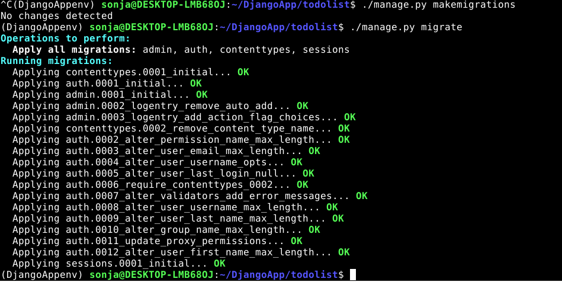

## h5 Ohjelmat weppipalvelimella, Python Django

Karvinen, T. 2022. Linux Palvelimet 2022. Luettavissa: https://terokarvinen.com/2021/linux-palvelimet-ict4tn021-3018/

#### a) CRUD. Make a simple web program, that allows multiple users modify the same data. Have user accounts and logins. You can use Django development server and admin interface here. Single table is enough. We already did a Customer (CRM) database, so it might be interesting to do something as simple, but slightly different.

Aion tehdä yksinkertaisen Todolist-sovelluksen. Aloitin tekemällä kansion, johon tulee kaikki tarvittava sovelluksia varten:

    $ mkdir DjangoApp
    
Menin kansioon (cd DjangoApp) ja laitoin sinne kehitysympäristön:

    $ virtualenv --system-site-packages -p python3 DjangoAppenv/
    
Jos virtualenv ei olisi vielä asennettuna, sen saa asennettua komennolla

    $ sudo apt-get -y install virtualenv

Seuraavaksi aktivoin virtualenvin:

    $ source DjangoAppenv/bin/activate
    
Tässä vaiheessa oli tärkeää tarkistaa, että pip oli oikeassa paikassa. Tarkistus onnistui komennolla

    $ which pip

ja vastauksena tuli toivotunlainen polku --> /home/sonja/DjangoApp/DjangoAppenv/bin/pip

Asensin seuraavaksi micron (tekstieditorin):

    $ sudo apt-get install micro
    
Se olikin jo asennettuna.

Sitten tein tekstitiedoston, johon kirjoitin ohjelmat, jotka halusin asentaa eli tässä tapauksessa django

    $ micro requirements.txt
    
Tarkistin, että teksti oli tallentunut oikein:

    $ cat requirements.txt

Teksti "django" oli tallentunut. Sitten asensin tekstitiedostossa määritellyn ohjelman:

    $ pip install -r requirements.txt
    
Tarkistin, oliko versio viimeisin

    $ django-admin --version
    
ja vastaus oli toivottu eli versio 4.0.2.

Seuraavaksi loin uuden projektin

    $ django-admin startproject todolist
   
Menin projektiin (cd todolist) ja käynnistin sen serverillä

    $ ./manage.py runserver
    

    
Menin osoitteeseen ja käynnistys oli onnistunut hyvin. Komentotulkissa oli muistutus migraatioiden tekemisestä.

Katkaisin yhteyden (ctrl + C). Sitten päivitin tietokannat komennoilla

    $ ./manage.py makemigrations
    $ ./manage.py migrate
    

Seuraavaksi loin ensimmäisen käyttäjän pääkäyttäjäoikeuksin. Sitä ennen autogeneroin salasanan

    $ pwgen -s 20 1
    
Jos pwgen-työkalua ei vielä olisi ollut asennettuna, sen saa asennettua komennolla:

    $ sudo apt-get install pwgen
    
Loin käyttäjän komennolla:

    $ ./manage.py createsuperuser

    
Testasin, pääsenko kirjautumaan uudella käyttäjälläni. Käynnistin projektin uudestaan serverillä ($ ./manage.py runserver) ja menin osoitteeseen $ ./manage.py runserver/admin. Kirjoitin käyttäjänimen iines ja salasanan. Kirjautuminen onnistui ja käyttäjä iines löytyi Users-listalta

Tein vielä toisen käyttäjän nimeltä aku käyttäliittymästä (Add User). Se onnistui hyvin.

Seuraavaksi lähdin luomaan tietokantaa Todolistille. Loin uuden kansion nimeltä todos Todolist-sovellukselle:

    $ ./manage.py startapp todos
    
Lisäsin todos-kansion sovelluksen asetuksiin:

    $ micro todolist/settings.py
    
Asetukset-tiedosto avautui ja etsin kohdan INSTALLED_APPS. Lisäsin viimeiselle riville 'todos'.

Sitten lähdin tekemään modelia, jonka pohjalta Django osaa muodostaa automaattisesti mm. tietokannat ja käyttäjänäkymät. Annoin komennon

    $ micro todos/models.py
    
tiedostossa oli valmiina from django.db import models eli django-tietokannasta importoidaan model-ominaisuus. Lisäsin tiedostoon taulun nimeltä Todo ja sille sarakkeen nimeltä todoitem. 

Tiedoston tallenuksen jälkeen tein taas migraatiot eli

    $ ./manage.py makemigrations
    $ ./manage.py migrate

Seuraavaksi lisäsin juuri tekemäni modelin admin.py -tiedstoon, jotta se näkyisi admin-endpointissa:

    $ micro todos/admin.py
    
Tiedostossa oli jälleen jo valmiina from django.db import models. Rekisteröin adminin luokkineen (Todo) sinne.

Käynnistin serverin ($ ./manage.py runserver) ja kävin katsomassa, miltä käyttöliittymässä näytti. 

Rekisteröinti oli onnistunut hyvin. Lisäsin tehtävälistaan tehtäviä (Add Todo) neljä kappaletta. Ne tallentuivat, mutta näkyivät listassa muodossa Todo object (1) jne. Laitoin seuraavaksi kirjoittamani tehtävät näkymään listassa muokkaamalla models.py -tiedostoa:

    $ micro todos/models.py
    
Todo oli muutettava merkkijonoksi (String). Muokkasin tiedostoa alla olevan kuvan mukaisesti:

Käynnistin taas serverin ja katsoin, olivat muutokset tulleet voimaan. Kaikki oli onnistunut hyvin.

#### b) Prod. Make a production style Django install. Use Apache and mod_wsgi, disable DEBUG.

